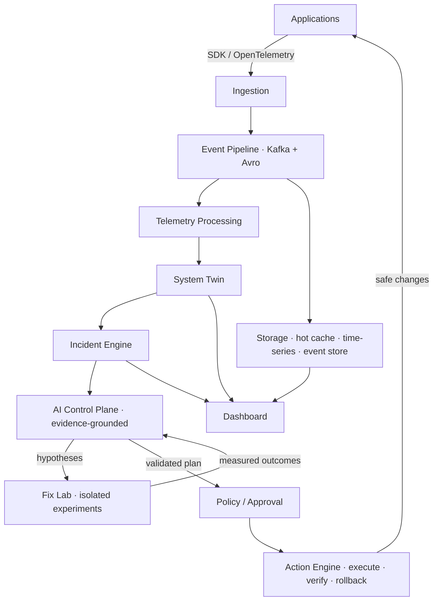

<div align="center">

# ⚡ LiveScope

### Observe. Reproduce. Fix. Verify.

**An AI-native observability and autonomous reliability platform**

Event-Sourced · CQRS · System Twin · Fix Lab · Evidence-Grounded AI

[](https://www.typescriptlang.org/)
[](https://kafka.apache.org/)
[](LICENSE)

</div>

---

> **LiveScope doesn't stop at telling you what's broken.** It reconstructs the incident from real telemetry, tests possible remediations in a controlled environment (the **Fix Lab**), selects the safest effective fix, executes it when authorized, verifies recovery empirically, rolls back if verification fails, and remembers everything for next time.

---

## What it is

LiveScope closes the loop that every observability tool leaves open:

```text
OBSERVE → DETECT → INVESTIGATE → UNDERSTAND → RECONSTRUCT →
EXPERIMENT → COMPARE FIXES → EXECUTE → VERIFY → ROLLBACK IF NEEDED → LEARN
```

Traditional monitoring ends at the red graph and the page. Everything after — investigation, root-cause analysis, change evaluation, safe execution, verification — is manual human work under time pressure. LiveScope automates that *safely*:

- **System Twin** — a continuously updated, provenance-tracked model of your services, dependencies, deployments, configuration, and history, queryable at "now" or any past timestamp. ([docs](docs/04-system-twin.md))
- **Fix Lab** — candidate fixes are evaluated in isolation before production is touched: counterfactual replay, incident traffic replay, sandbox execution — compared on recovery probability, risk, blast radius, cost, and calibrated confidence. ([docs](docs/05-fix-lab.md))
- **Evidence-grounded AI** — every diagnosis cites the exact metrics, logs, traces, and changes that support it; competing hypotheses are generated and actively refuted. ([docs](docs/06-ai-architecture.md))
- **Safe execution** — plans are validated deterministically, approved by humans (or auto-executed only under explicit policy), executed by a non-LLM Action Engine with scoped short-lived credentials, verified against live telemetry, and rolled back automatically on failure. ([docs](docs/08-safety-and-autonomy.md))

The system answers: **What is broken? Why? What happens if we change X? Which fix is safest? Did the fix actually work?**

## Why it exists

- Detection is a solved problem; **diagnosis is not.** Incident commanders still manually correlate alerts, diffs, logs, and traces under pressure.
- **AI agents that modify production based on belief are a liability.** LiveScope's core idea: demonstrate a fix works *before* proposing it — in a Fix Lab, with measured evidence and a rollback path.
- Organizations re-diagnose the same incident classes over and over. **Incident memory** makes the system measurably better with every incident.

## Architecture (target)



Three planes, three trust levels ([docs](docs/03-system-overview.md)):
- **Data plane** (low trust, high volume) — telemetry ingestion and processing; all telemetry is untrusted input.
- **Control plane** (highest trust) — orgs, policies, approvals, audit; the *only* granter of AI permissions.
- **AI plane** (bounded capability) — investigation, Fix Lab, planning; zero standing credentials, registry-scoped tools only.

## Safety model (non-negotiable)

- Autonomy levels: `OBSERVE_ONLY → ASSISTED → APPROVAL_REQUIRED → AUTO_SAFE` — human-set policy, promoted only on measured evaluation history. `AUTONOMOUS` is explicitly not on the roadmap. ([docs](docs/08-safety-and-autonomy.md))
- The LLM never holds production credentials; mutating actions run in a deterministic executor with per-execution scoped credentials.
- Destructive operations do not exist in the tool registry — the denylist is structural. ([docs](docs/07-agent-tools.md))
- Telemetry/logs/commits are data, never instructions; prompt-injection resistance is benchmark-gated. ([docs](docs/16-ai-evaluation.md))
- No remediation is "successful" because a command returned 200 — recovery must be observed in live telemetry, with automatic rollback otherwise. ([docs](docs/09-incident-engine.md))

## Current Status

**LiveScope is early in construction. What exists today vs. what is planned:**

| Capability | Status |
|---|---|
| Monorepo (Turborepo + pnpm + TypeScript) | ✅ Implemented |
| Local infra: Kafka + Zookeeper + Schema Registry (Docker Compose) | ✅ Implemented |
| Event schemas: Avro `METRIC_RECORDED` + serializer + TS types | ✅ Implemented |
| Gateway | ✅ Ingest API, DLQ, circuit breaker, `/healthz`, gRPC `BatchEvents` |
| SDK, vector-clock, CRDT, diff-engine, query-engine, utils | ✅ Implemented and tested |
| Projection, stream, anomaly, chaos, region, dashboard | ✅ Implemented and tested in-process |
| System Twin, incidents, investigation, Fix Lab, approvals, rollback, forecast | ✅ `@livescope/reliability`, covered by the six-scenario suite |

The reliability loop is evidence-gated and policy-gated in code. A rules investigator cites telemetry; it does not call an external model. Live Kafka, Redis, and Postgres start from `infra/docker-compose.yml`. The scenario suite is the regression gate ([docs](docs/16-ai-evaluation.md)).

## Getting started (developer)

> Prerequisites: Docker, Node.js 20+, pnpm 8+.

```bash
git clone https://github.com/yourusername/livescope.git
cd livescope

# Start infrastructure (Kafka, Schema Registry)
docker compose -f infra/docker-compose.yml up -d

pnpm install
pnpm build
```

End-to-end today: the gateway script encodes a `METRIC_RECORDED` event via Avro against the Schema Registry and produces it to the `metrics.raw` Kafka topic — the entire telemetry contract layer in one run. The next build steps are specified in [BUILD-PLAN.md](BUILD-PLAN.md); the product direction in [docs/18-roadmap.md](docs/18-roadmap.md).

## Documentation (source of truth)

| Doc | Contents |
|---|---|
| [01 — Product vision](docs/01-product-vision.md) | thesis, principles, what LiveScope is *not* |
| [02 — Product requirements](docs/02-product-requirements.md) | P0/P1/P2 requirements with acceptance criteria |
| [03 — System overview](docs/03-system-overview.md) | target architecture, three planes, current reality |
| [04 — System Twin](docs/04-system-twin.md) | the live + historical model of the observed system |
| [05 — Fix Lab](docs/05-fix-lab.md) | **the core differentiator** — experiments, comparison, selection |
| [06 — AI architecture](docs/06-ai-architecture.md) | orchestrator, evidence loop, hypotheses, confidence |
| [07 — Agent tools](docs/07-agent-tools.md) | tool registry, risk levels, permissions |
| [08 — Safety & autonomy](docs/08-safety-and-autonomy.md) | autonomy levels, policy, kill switch, prompt injection |
| [09 — Incident Engine](docs/09-incident-engine.md) | lifecycle state machine, correlation, postmortems |
| [10 — Data model](docs/10-data-model.md) | entities, storage split, retention |
| [11 — SDK & ingestion](docs/11-sdk-and-ingestion.md) | developer experience, batching, OTLP |
| [12 — API contracts](docs/12-api-contracts.md) | conceptual REST/WS surface |
| [13 — Dashboard UX](docs/13-dashboard-ux.md) | screens incl. Fix Lab comparison UI |
| [14 — Security](docs/14-security.md) | tenants, credentials, agent permissions |
| [15 — Reliability](docs/15-reliability.md) | failure catalog and recovery strategies |
| [16 — AI evaluation](docs/16-ai-evaluation.md) | how we prove the AI actually works |
| [17 — Demo scenarios](docs/17-demo-scenarios.md) | six reproducible end-to-end incidents |
| [18 — Roadmap](docs/18-roadmap.md) | vertical capability phases with gates |
| [19 — Architecture decisions](docs/19-architecture-decisions.md) | ADRs incl. honest revisions of the original stack |
| [20 — Non-goals](docs/20-non-goals.md) | scope-explosion firewall |

Tactical build checklist for the data plane: [BUILD-PLAN.md](BUILD-PLAN.md).

## Unresolved architecture questions (tracked openly)

1. Avro→TypeScript codegen vs hand-mirrored types ([ADR-02](docs/19-architecture-decisions.md)).
2. Redis Streams vs Pub/Sub for stream-engine sourcing — decide with Phase 1 load tests.
3. Event store: proposed Postgres/Timescale consolidation replaces the original MongoDB plan ([ADR-04](docs/19-architecture-decisions.md)) — needs a write-throughput benchmark to confirm.
4. Fix Lab sandbox substrate (namespace-per-experiment vs pooled sandboxes) — Phase 5 design spike.
5. Vector clocks vs Hybrid Logical Clocks if per-entity writer counts grow ([ADR-07](docs/19-architecture-decisions.md)).
6. Notification channels (Slack/webhooks) scope before approval UX lands.

## License

MIT — see [LICENSE](LICENSE)