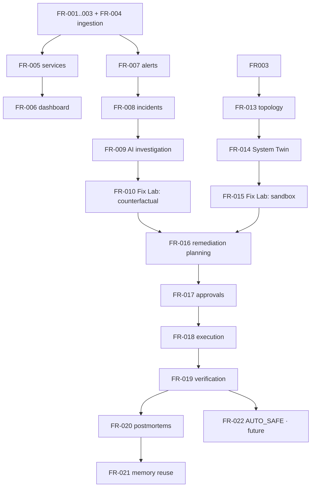

# 02 — Product Requirements

> Status labels: `[IMPLEMENTED]` exists in repo · `[IN PROGRESS]` being built · `[PLANNED]` committed design, not started · `[PROPOSED]` design direction, needs validation · `[FUTURE]` post-vision, explicitly out of current scope.
>
> Priorities: **P0 = MVP**, **P1 = Post-MVP**, **P2 = Future**. Every requirement below follows the format: ID, Name, Description, Priority, User value, Dependencies, Acceptance criteria.

---

## P0 — MVP

The MVP is the **Observe + Detect + Investigate** slice: a user can instrument a service, see it live, get incidents with AI-generated evidence-grounded diagnosis. Fix Lab ships in minimal form (counterfactual replay) because without it LiveScope is "just another AIOps alert." Full experimentation is P1.

---

**FR-001 — Telemetry ingestion (metrics)** `[PLANNED]` (pipeline partially `[IN PROGRESS]`: Kafka + Avro for `METRIC_RECORDED` works end-to-end from a test script)
- Description: SDK and gateway accept numeric metric events with tags, validate them against the Avro schema, and publish them to Kafka keyed by entity.
- Priority: P0
- User value: Foundation of every later capability.
- Dependencies: `packages/event-schemas` `[IMPLEMENTED]`, gateway-as-server `[PLANNED]`.
- Acceptance criteria: SDK-emitted metric → Kafka topic `metrics.raw` with Avro schema ID; malformed events rejected to DLQ `events.dlq`; P99 SDK-emit→Kafka-ack < 50ms on local stack.

**FR-002 — Telemetry ingestion (logs)** `[PLANNED]` (TS types + topic constant exist; Avro schema + pipeline missing)
- Description: Structured log events with level, message, and metadata, ingested via the same pipeline.
- Priority: P0
- User value: Logs are the primary evidence type for AI investigation.
- Dependencies: FR-001.
- Acceptance criteria: Log events flow SDK → gateway → Kafka `logs.raw`; DLQ rejects malformed events; log search returns results within 2s over 1M stored events.

**FR-003 — Telemetry ingestion (traces)** `[PLANNED]` (TS types + topic constant exist; Avro schema + pipeline missing)
- Description: Distributed trace spans with operation name, duration, tags, and causal/parent linkage.
- Priority: P0
- User value: Traces identify *where* in a dependency chain latency/errors originate.
- Dependencies: FR-001.
- Acceptance criteria: Spans flow to `traces.raw`; a trace with 10 spans across 3 services can be reconstructed and displayed as a waterfall.

**FR-004 — OpenTelemetry (OTLP) ingestion** `[PROPOSED]`
- Description: Accept OTLP/gRPC and OTLP/HTTP telemetry so users can instrument with existing OTel SDKs instead of only ours.
- Priority: P0 (co-shipped with SDK in Phase 1) — adopting LiveScope must not require re-instrumentation.
- User value: Removes the #1 adoption blocker ("I already have OTel").
- Dependencies: FR-001..003 pipeline.
- Acceptance criteria: A standard OTel SDK (Collector or direct OTLP exporter) produces metrics/logs/traces visible in LiveScope without a LiveScope SDK installed.

**FR-005 — Services & service catalog** `[PLANNED]`
- Description: Auto-discovered catalog of services seen in telemetry, with environment, version, deployment identity, and health.
- Priority: P0
- User value: The primary navigation unit of the product.
- Dependencies: FR-001..003.
- Acceptance criteria: A service emitting telemetry appears in the catalog within 30s without manual registration; catalog shows current version and health.

**FR-006 — Service dashboard (live)** `[PLANNED]` (React dashboard app scaffolded empty)
- Description: Zero-polling dashboard: service grid, per-service metrics, logs, traces, live state diffs over WebSockets.
- Priority: P0
- User value: The visible face of the product; "no refresh" is the first demo.
- Dependencies: FR-005, stream pipeline `[PLANNED]`.
- Acceptance criteria: Dashboard updates in <1s of event emission; no HTTP polling in the client; reconnect recovers with SNAPSHOT-then-PATCH.

**FR-007 — Alerts** `[PLANNED]` (anomaly-detector app scaffolded empty)
- Description: Threshold and EWMA-based anomaly alerts on metrics, deduplicated, with severity.
- Priority: P0
- User value: Detection is the entry point to the incident loop.
- Dependencies: FR-001, FR-005.
- Acceptance criteria: Injected fault (via seed/chaos tooling) produces a correctly-attributed alert within 30s; no duplicate alerts for a sustained single condition.

**FR-008 — Incidents** `[PLANNED]`
- Description: Alert correlation into incidents with lifecycle state machine, timeline, affected services, severity. (See [09-incident-engine.md](09-incident-engine.md).)
- Priority: P0
- User value: One coherent thing to respond to instead of N alert pages.
- Dependencies: FR-007.
- Acceptance criteria: A deployment-regression fault produces exactly one incident linking the affected service, correlated alerts, and a timeline; state transitions are auditable.

**FR-009 — AI investigation** `[PROPOSED]`
- Description: On incident creation, an AI investigation runs: gathers evidence (metrics, logs, traces, deployment diffs, configuration), generates ranked root-cause hypotheses with citations, and produces a diagnosis report. (See [06-ai-architecture.md](06-ai-architecture.md).)
- Priority: P0 — this is the differentiator of the MVP; without it LiveScope is a dashboard.
- User value: "Why is it broken?" answered with evidence, in minutes not hours.
- Dependencies: FR-005..008, agent tool layer `[PROPOSED]` (read-only tools only at this level).
- Acceptance criteria: On the benchmark scenario suite ([16-ai-evaluation.md](16-ai-evaluation.md)), ≥70% scenarios with correct top-1 root cause; every hypothesis carries ≥1 verifiable evidence citation; no tool call outside read-only allowlist.

**FR-010 — Fix Lab (minimal: counterfactual replay)** `[PROPOSED]`
- Description: Minimal Fix Lab experiment type: given an incident and a candidate fix, replay stored incident-period telemetry against the System Twin and produce a predicted outcome ("with rollback deployed, error rate would have returned to baseline within ~2 min") with confidence. (See [05-fix-lab.md](05-fix-lab.md) § Experiment types.)
- Priority: P0 — even minimal "reconstruct + predict" makes remediation advice evidence-based instead of opinion-based.
- User value: First taste of "what will happen if we change X?"
- Dependencies: FR-008, historical state reconstruction (FR-014).
- Acceptance criteria: For each benchmark incident, Fix Lab produces a comparison of ≥2 candidate fixes with predicted outcome, risk, blast radius, and confidence; predictions are evaluated against ground truth in the benchmark suite.

**FR-011 — Incident memory** `[PROPOSED]` (minimal form)
- Description: Incidents, diagnoses, experiments, and outcomes stored as queryable structured records, retrievable by similarity for future investigations.
- Priority: P0 (minimal: storage + retrieval), P1 (AI reuse of memory).
- User value: The system gets better with each incident; recurring incidents are recognized.
- Dependencies: FR-008, FR-009.
- Acceptance criteria: A repeat of a known incident scenario surfaces the prior diagnosis in the investigation report automatically.

**FR-012 — Project/organization/account model** `[PROPOSED]`
- Description: Organizations → projects → environments → services; users, roles, API keys. ([10-data-model.md](10-data-model.md), [14-security.md](14-security.md).)
- Priority: P0 (single-tenant local mode may hardcode one org, but the data model must exist from day one).
- User value: Multi-tenant safety and correct authorization boundaries.
- Dependencies: none.
- Acceptance criteria: All telemetry and product data is scoped by org/project/environment; cross-tenant queries are impossible by construction (tested).

---

## P1 — Post-MVP

**FR-013 — Service topology** `[PROPOSED]`
- Description: Dependency graph inferred from traces and infrastructure metadata, maintained in the System Twin.
- Priority: P1
- User value: "What is affected / what depends on this" — the basis of blast-radius analysis.
- Dependencies: FR-003, System Twin (FR-014).
- Acceptance criteria: Topology derived from a 3-service trace chain matches ground truth; edge confidence/staleness is displayed.

**FR-014 — System Twin** `[PROPOSED]`
- Description: Continuously updated representation of services, dependencies, deployments, configs, infrastructure, traffic, health, and history, with provenance and staleness tracking. (See [04-system-twin.md](04-system-twin.md).)
- Priority: P1 (MVP needs only incident-scoped reconstruction; the full Twin is Post-MVP).
- User value: The shared model both the AI and Fix Lab reason over; enables "what will happen if X".
- Dependencies: FR-005, FR-013, historical reconstruction (snapshot+replay `[PLANNED]`).
- Acceptance criteria: Twin can answer structured queries (current state, state at time T, dependencies of service S) with provenance and freshness; a demo topology with 5 services and 8 edges is correctly maintained and time-queried.

**FR-015 — Fix Lab (sandbox execution)** `[PROPOSED]`
- Description: Run candidate fixes in an isolated environment — replayed traffic or shadow traffic against a temporary deployment — and measure real outcomes, not just predictions.
- Priority: P1
- User value: "Demonstrated to work" instead of "predicted to work."
- Dependencies: FR-014, workload replay, environment orchestration.
- Acceptance criteria: For a seeded incident, ≥1 candidate fix executes in sandbox, measured outcome recorded, comparison report produced; sandbox teardown guaranteed (no leaked resources).

**FR-016 — Remediation planning** `[PROPOSED]`
- Description: AI produces a structured RemediationPlan: ordered steps, each with tool calls, risk, blast radius, preconditions, and rollback strategy. (See [06-ai-architecture.md](06-ai-architecture.md) § Planning.)
- Priority: P1
- User value: Reviewable, auditable action sequence instead of freeform AI prose.
- Dependencies: FR-009, FR-010/15, tool layer ([07-agent-tools.md](07-agent-tools.md)).
- Acceptance criteria: Every plan step passes policy validation (allowlist, blast-radius limit, rollback defined) *before* it can be approved; invalid plans are rejected with explicit reasons.

**FR-017 — Approval workflows** `[PROPOSED]`
- Description: Approval requests for remediation plans: who approves, what they see (plan + experiment evidence + risk), expiry, delegation, escalation. Required for all mutating actions at `APPROVAL_REQUIRED` autonomy. ([08-safety-and-autonomy.md](08-safety-and-autonomy.md).)
- Priority: P1
- User value: Human control with full context in one place.
- Dependencies: FR-016.
- Acceptance criteria: No mutating tool call executes without a recorded approval (or matching `AUTO_SAFE` policy); approvals are immutable audit records.

**FR-018 — Action execution (Action Engine)** `[PROPOSED]`
- Description: Executes approved plans through the mutating tool layer with per-action timeouts, rate limits, execution logs, and rollback hooks. (See [07-agent-tools.md](07-agent-tools.md) § Mutating.)
- Priority: P1
- User value: Controlled, audited, reversible changes.
- Dependencies: FR-016, FR-017, integrations (K8s, deployment systems) `[PROPOSED]`.
- Acceptance criteria: Every executed action produces an `AgentExecution` audit record with before/after state; a mid-plan failure triggers the defined rollback path; a kill switch halts all execution within 1s.

**FR-019 — Verification** `[PROPOSED]`
- Description: Post-remediation verification: defined success criteria (e.g. error rate < X for N minutes) evaluated against live production telemetry; automatic rollback on failure. (Rule 9 — success is never "the command returned 200".)
- Priority: P1
- User value: Trust that "resolved" means actually resolved.
- Dependencies: FR-018, FR-007.
- Acceptance criteria: A remediation whose success criteria are not met within the verification window automatically rolls back and the incident moves to `ROLLING_BACK`/`FAILED` per the state machine ([09-incident-engine.md](09-incident-engine.md)).

**FR-020 — Incident postmortems** `[PROPOSED]`
- Description: Structured postmortem generated from the incident record: timeline, root cause, evidence, remediation taken, verification outcome, and lessons; human-editable.
- Priority: P1
- User value: Durable organizational learning; feeds FR-011.
- Dependencies: FR-008, FR-009, FR-019.
- Acceptance criteria: For each resolved incident, a complete postmortem draft exists with citations into telemetry; humans can edit without breaking links to the underlying records.

**FR-021 — AI incident memory reuse** `[PROPOSED]`
- Description: Investigations consult prior incidents and their outcomes (successful and failed fixes) as weighted evidence.
- Priority: P1
- User value: The system measurably improves; recurring problems resolve faster.
- Dependencies: FR-011, FR-020.
- Acceptance criteria: Benchmark suite shows improved diagnosis latency/accuracy on second occurrence of an incident class.

---

## P2 — Future

**FR-022 — Policy-driven safe autonomy (`AUTO_SAFE`)** `[FUTURE]`
- Description: Pre-approved action classes (e.g. "rollback last deployment if error rate > 5% and recovery confidence > 90%") execute without per-incident approval, within blast-radius limits. (See [08-safety-and-autonomy.md](08-safety-and-autonomy.md).)
- Dependencies: FR-016..019, extensive evaluation history ([16-ai-evaluation.md](16-ai-evaluation.md)).
- Acceptance criteria: 100 simulated policy evaluations with zero unauthorized actions; every auto-executed action is auditable and rolls back on failed verification.

**FR-023 — Chaos experiment toolkit** `[PLANNED]` (chaos-engine app scaffolded; productization is FUTURE)
- Description: Controlled fault injection for both resilience testing and Fix Lab "dependency simulation" experiments.
- Dependencies: FR-014, FR-015.
- Acceptance criteria: Faults injected via API with TTL and automatic expiry; every fault logged as telemetry.

**FR-024 — Predictive reliability** `[FUTURE]`
- Description: Pre-incident simulation: forecast risk conditions (e.g. connection-pool exhaustion in ~40 min at current trend) and recommend preventive changes, evaluated in Fix Lab.
- Dependencies: FR-014, FR-015, FR-022 prerequisites.
- Acceptance criteria: Predicted incidents occur in ≥60% of cases on a reproducible benchmark; recommendations carry experiment evidence.

**FR-025 — Multi-region operation** `[FUTURE]` (region-simulator app scaffolded as a simulation, not real multi-region)
- Dependencies: Control plane maturity ([14-security.md](14-security.md)).
- Acceptance criteria: Region-partition demo with convergence, mirroring the existing vector-clock/CRDT design intent.

---

## Cross-cutting requirements (apply to all)

| ID | Requirement | Priority | Acceptance criteria |
|---|---|---|---|
| NFR-1 | Tenant isolation | P0 | Automated tests prove cross-org data inaccessibility |
| NFR-2 | Audit trail | P0 | Every AI tool call and mutating action is recorded with inputs, outputs, principal, and result |
| NFR-3 | Agent safety | P0 | Zero unauthorized tool calls in the full benchmark suite, including prompt-injection attempts ([16-ai-evaluation.md](16-ai-evaluation.md)) |
| NFR-4 | Ingestion performance | P1 | 50k events/sec sustained locally; P99 emit→dashboard < 1s |
| NFR-5 | Prompt-injection resistance | P0 | Malicious telemetry content never alters agent behavior or tool selection ([08-safety-and-autonomy.md](08-safety-and-autonomy.md) § Prompt injection) |
| NFR-6 | LLM provider abstraction | P1 | Provider swappable without changing agent logic; costs and latencies tracked per capability |

## Requirement dependency map

