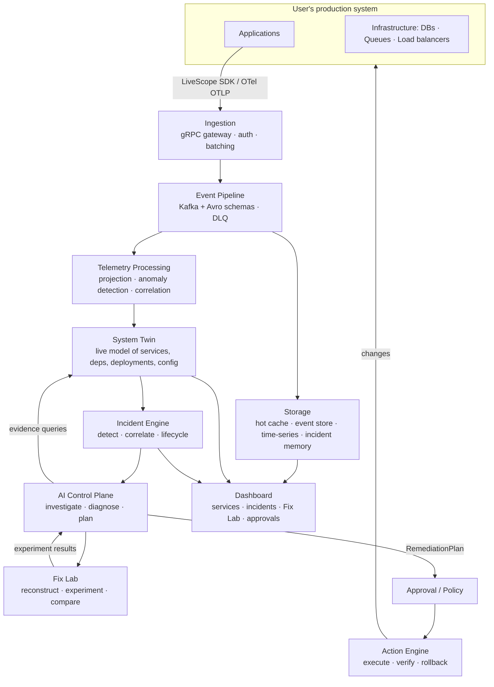
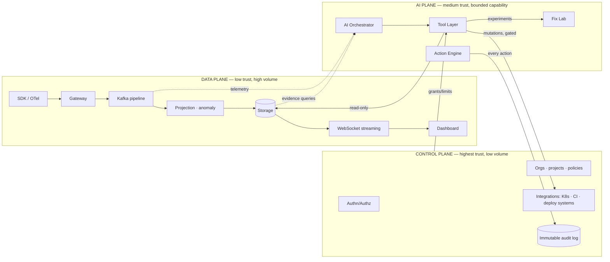
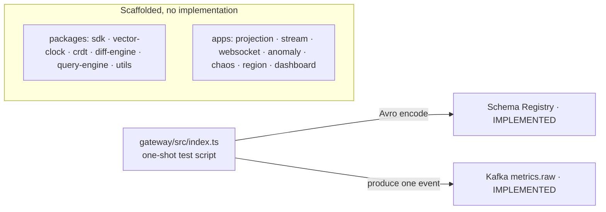

# 03 — System Overview

> Status: this document describes the **target architecture**. The implemented fraction is marked `[IMPLEMENTED]`; everything else is `[PLANNED]` or `[PROPOSED]`. See [Current reality](#current-reality-vs-target-architecture) and [18-roadmap.md](18-roadmap.md).

## The system in one sentence

Applications emit telemetry through the LiveScope SDK (or OpenTelemetry) into an event pipeline; the pipeline maintains a live model of the system (**System Twin**); the **Incident Engine** detects problems and the **AI Control Plane** investigates them; candidate fixes are evaluated in the **Fix Lab**; approved fixes are executed by the **Action Engine**, verified against live telemetry, and rolled back if verification fails.

## High-level architecture



The product loop mapped onto components:

```text
OBSERVE      → SDK, Ingestion, Event Pipeline, Storage, Dashboard
DETECT       → Telemetry Processing (anomaly/threshold), Incident Engine
INVESTIGATE  → AI Control Plane (read-only tools over Storage + Twin)
UNDERSTAND   → AI diagnosis with evidence citations
RECONSTRUCT  → System Twin historical state + replay
EXPERIMENT   → Fix Lab
COMPARE      → Fix Lab comparison reports
EXECUTE      → Action Engine (after policy/approval)
VERIFY       → Action Engine verification against live telemetry
ROLLBACK     → Action Engine rollback paths
LEARN        → Incident memory + postmortems
```

## The three planes

LiveScope is explicitly separated into three planes with different trust levels, failure domains, and security requirements.



### Data Plane — telemetry collection, ingestion, processing

- **Trust level:** lowest. All telemetry is untrusted input (it can contain hostile content — see [08-safety-and-autonomy.md](08-safety-and-autonomy.md) § Prompt injection).
- **Volume:** high (tens of thousands of events/sec target).
- **Components:** SDK/OTLP ingestion `[PLANNED]`, gRPC gateway `[PLANNED — today only a one-shot producer script exists]`, Kafka pipeline `[IMPLEMENTED — Kafka + Schema Registry + Avro for METRIC_RECORDED]`, projection/processing `[PLANNED]`, storage `[PARTIAL — Kafka only; Redis/Mongo/TimescaleDB planned]`, WebSocket streaming to dashboard `[PLANNED]`.
- **Rule:** the data plane never executes anything. It only observe, store, and stream.

### Control Plane — projects, users, permissions, policies, integrations

- **Trust level:** highest. This is where authorization decisions are made.
- **Volume:** low.
- **Components (all `[PROPOSED]`):** org/project/environment model, user roles, API keys, autonomy policies, approval workflows, integration credentials (Kubernetes, deployment systems, Git), immutable audit log.
- **Rule:** the control plane is the *only* component that can grant the AI plane access to mutating tools. Grants are explicit, scoped, revocable, and fully audited ([14-security.md](14-security.md)).

### AI Plane — investigation, reasoning, planning, experimentation, remediation

(Also called the **AI Control Plane** in some diagrams — same thing: the capability plane the AI orchestrator, Fix Lab, and Action Engine live in.)

- **Trust level:** medium and *bounded by capability*, not by hope. The AI plane has zero standing production credentials. It can only do what the tool layer permits, which is only what control-plane policy allows.
- **Components (all `[PROPOSED]`):** AI Orchestrator with read-only tools (investigation), Fix Lab (experiment tools), Remediation Planning, Action Engine (gated mutating tools + verification). See [06-ai-architecture.md](06-ai-architecture.md).
- **Rule:** every AI action flows through the permissioned tool layer ([07-agent-tools.md](07-agent-tools.md)); there is no shell, no direct DB access, no bypass.

## Current reality vs target architecture

**What exists today** (audited from the repository):



| Layer | Status | Notes |
|---|---|---|
| Monorepo (Turborepo, pnpm, TS) | `[IMPLEMENTED]` | Build orchestration works; most packages are empty scaffolds |
| Docker infra | `[PARTIAL]` | Kafka + Zookeeper + Schema Registry only; Mongo/Redis/TimescaleDB planned |
| Event schemas | `[IMPLEMENTED]` | Avro `METRIC_RECORDED` + TS types for log/span; only metric schema registered |
| Ingestion | `[IN PROGRESS]` | Gateway is a one-shot script; a real gRPC server is planned |
| All other data-plane components | `[PLANNED]` | See [BUILD-PLAN.md](../BUILD-PLAN.md) phases 1–4 |
| Control plane | `[PROPOSED]` | Nothing exists |
| AI plane, System Twin, Fix Lab, Action Engine | `[PROPOSED]` | Nothing exists |

The path from current reality to the target is [18-roadmap.md](18-roadmap.md); the tactical build sequence for the data plane is [BUILD-PLAN.md](../BUILD-PLAN.md).

## Component responsibilities (target)

| Component | Plane | Responsibility | Status |
|---|---|---|---|
| SDK | Data | Instrument apps: metrics, logs, traces; batching, retries, identity | `[PLANNED]` |
| OTLP ingestion | Data | Accept standard OpenTelemetry telemetry | `[PROPOSED]` |
| Gateway | Data | Authenticate, validate, encode, produce to Kafka (keyed by entity) | `[PLANNED]` |
| Event pipeline | Data | Kafka topics, Avro schemas, DLQ, schema evolution | `[PARTIAL]` |
| Telemetry processing | Data | Consume Kafka → project state → detect anomalies → correlate | `[PLANNED]` |
| Storage | Data | Redis hot state, TimescaleDB metrics, event store, incident memory | `[PLANNED]` |
| WebSocket streaming | Data | Diff-based live push to dashboard with backpressure | `[PLANNED]` |
| System Twin | AI | Live + historical model of the user's system with provenance | `[PROPOSED]` |
| Incident Engine | AI/Control | Detection → incident lifecycle state machine | `[PROPOSED]` |
| AI Orchestrator | AI | Evidence-gathering loop, diagnosis, planning, tool use | `[PROPOSED]` |
| Fix Lab | AI | Isolated experiment execution and comparison | `[PROPOSED]` |
| Action Engine | AI/Control | Gated execution, verification, rollback | `[PROPOSED]` |
| Control plane | Control | Authn/authz, org model, policies, approvals, audit | `[PROPOSED]` |
| Dashboard | Data/UI | Live views, incident investigation, Fix Lab comparison, approvals | `[PLANNED]` |

## Related documents

- System Twin: [04-system-twin.md](04-system-twin.md)
- Fix Lab: [05-fix-lab.md](05-fix-lab.md)
- AI architecture: [06-ai-architecture.md](06-ai-architecture.md)
- Incident lifecycle: [09-incident-engine.md](09-incident-engine.md)
- Data model: [10-data-model.md](10-data-model.md)
- Technology decisions and tradeoffs: [19-architecture-decisions.md](19-architecture-decisions.md)