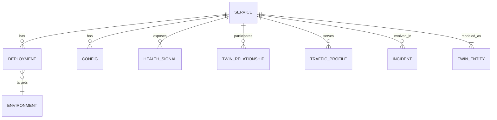
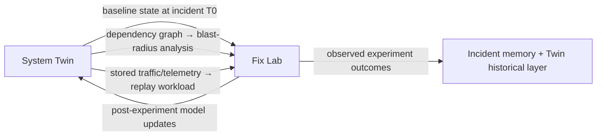

# 04 — System Twin

> Status: `[PROPOSED]`. Nothing is implemented. The existing vector-clock / CRDT / projection design (see [BUILD-PLAN.md](../BUILD-PLAN.md), [19-architecture-decisions.md](19-architecture-decisions.md)) is the *substrate* the System Twin is built on — the projection engine's per-entity state becomes the Twin's live layer.

## Definition

The **LiveScope System Twin** is a continuously updated, queryable representation of the user's operational system — services, dependencies, deployments, configurations, infrastructure, traffic, health, historical behavior, and incidents — maintained by the data plane and consumed by both humans (dashboard) and the AI plane (investigation, Fix Lab).

The Twin is **not**:

- a full digital twin / physics simulation of the user's infrastructure;
- a configuration-management database (CMDB) that must be manually kept correct;
- a copy of all telemetry (it references telemetry, indexes and summarizes it).

The Twin **is**:

- a structured, provenance-tracked model assembled automatically from telemetry and integrations;
- queryable at "now" and at any past timestamp (historical reconstruction);
- explicit about uncertainty: every fact carries a source, a timestamp, and a confidence/freshness.

## What the Twin represents



| Twin concept | Examples |
|---|---|
| Services | `checkout-api`, `payment-worker`, `auth-service` |
| Dependencies (edges) | `checkout-api → postgres (critical)`, `checkout-api → payment-service (runtime)`, inferred from traces |
| Datastores/queues | Postgres connection counts, Kafka consumer lag — as Twin entities |
| Deployments | version, commit, deploy time, who/what triggered, diff vs previous |
| Configurations | relevant config (connection pool size, feature flags, HPA bounds) with version |
| Infrastructure | cluster/region, node count, resource limits — coarse grained |
| Traffic | RPS, latency percentiles, traffic mix, per-dependency call rates |
| Health | error rate, saturation, status; derived signals |
| Historical behavior | baselines, seasonality, capacity trends |
| Incidents | past incidents touching this entity and their outcomes |

## Core questions this document answers

### 1. What data feeds the System Twin?

Every Twin fact has exactly one **source of record** and is updated through the normal data-plane event pipeline — the Twin adds no new ingestion paths (this is deliberate: one pipeline, one trust boundary).

| Source | Feeds | Notes |
|---|---|---|
| SDK/OTel metrics | health, traffic, saturation | high volume, aggregated on ingest |
| SDK/OTel traces | dependency edges, call rates, latency per edge | primary source of topology |
| SDK/OTel logs | health signals, config-change evidence | parsed, not stored raw in the Twin |
| Deployment integration (K8s/CI webhooks) `[PROPOSED]` | deployments, versions, config | authoritative when present; otherwise inferred from telemetry tags |
| Configuration integration `[PROPOSED]` | configuration facts | versioned; never stores secret values (see [14-security.md](14-security.md)) |
| Incident Engine | incident records, past outcomes | written back into the Twin after resolution |

Inference vs authority: an edge *inferred from traces* is labeled `inferred, confidence 0.9, last_seen T`. An edge *declared by a deployment manifest* is labeled `declared`. The Twin never presents an inference as a declaration.

### 2. How is state updated?

Live state is maintained by the **projection engine** `[PLANNED]` consuming Kafka:

```text
event (keyed by entityId) → vector-clock merge (drop causally-old duplicates)
                          → CRDT merge into per-entity state (Redis)
                          → Twin entity updated (current layer)
                          → state change published (Redis Pub/Sub → stream engine → dashboard)
```

Two layers:

- **Live layer** — current per-entity state, CRDT-merged, sub-second freshness. This is exactly the projection-engine design in [BUILD-PLAN.md](../BUILD-PLAN.md) Phase 3.
- **Historical layer** — every accepted event is durably stored (event store) and the Twin can reconstruct any entity's state at time T by **snapshot + replay** `[PLANNED]`. The Twin is therefore an *event-sourced* model, not a mutable database that gets corrupted by bugs.

Graph structure (entities + relationships) is maintained in the control-plane database as `SystemTwinEntity` / `SystemTwinRelationship` rows (see [10-data-model.md](10-data-model.md)).

### 3. How is historical state reconstructed?

Replay: load the entity's latest snapshot ≤ T, then apply events with `timestamp ≤ T` in causal order. This is the same mechanism as the incident "time-travel" demo and is a hard prerequisite for Fix Lab replay experiments ([05-fix-lab.md](05-fix-lab.md)).

Constraints:

- Reconstruction returns **state as observed**, including any bugs in that state — it is a faithful record, not a corrected one.
- Causal ordering across nodes uses the existing vector-clock design; wall-clock is never the primary ordering.
- A reconstruction report always includes: snapshot id, event count applied, any gaps (e.g. events still in DLQ at that time).

### 4. How do we represent dependencies?

`SystemTwinRelationship` (see [10-data-model.md](10-data-model.md)):

```text
from: checkout-api
to: payment-service
kind: runtime_call | data_store | queue_produce | queue_consume | infra
confidence: 0.0–1.0
source: inferred(traces) | declared(manifest) | declared(integration)
first_seen / last_seen
metadata: { callRate, p99Latency, errorRate, criticalityHint }
```

Edges decay: an inferred edge unseen for N hours is marked `stale`; it is *never silently deleted*, because stale topology is often the very signal of an incident ("why did checkout stop calling payment?").

### 5. How do we handle stale information?

Every Twin fact carries `last_updated` and a per-fact-type freshness expectation (`health`: seconds, `topology edge`: hours, `deployment`: event-driven, `infrastructure`: minutes). Consumers see an explicit freshness state: `fresh | stale | unknown`. The AI plane is required to treat `stale`/`unknown` facts as unverified and say so in its reasoning — an investigation that relies on a stale deployment fact must cite it as such.

### 6. How do we know the model is trustworthy?

Three mechanisms, all required before the AI plane may lean on the Twin:

1. **Provenance** — every fact answers "who told me, when, how confident."
2. **Consistency checks** — a background validator flags contradictions (e.g. deployment says service scaled to 4 replicas, telemetry from only 1 instance seen for 10 min → Twin flags `degraded_confidence` and the investigation surfaces it).
3. **Ground-truth anchors** — where an integration is authoritative (K8s API for replicas), the Twin reconciles telemetry-derived facts against it and records mismatches rather than hiding them.

Trust is *measured*, not assumed: `TwinCoverage` metrics (fraction of entities with fresh facts, contradiction rate) are exposed to the dashboard and to the AI as context.

### 7. How does AI query it?

Through the **read-only tool layer only** ([07-agent-tools.md](07-agent-tools.md)):

```text
get_service_state(serviceId, at?)
get_system_topology(serviceId?, depth?)
get_deployment_history(serviceId, range?)
get_configuration(serviceId)
get_incident_history(serviceId | similarity query)
query_metrics(...) / search_logs(...) / get_trace(...)
```

Tools return **structured data with provenance**, not prose. The orchestrator cannot run arbitrary graph queries — this keeps the audit surface small and prevents prompt-injected content from smuggling query capabilities. (See [08-safety-and-autonomy.md](08-safety-and-autonomy.md).)

### 8. How does the System Twin interact with Fix Lab?

The Twin is the Fix Lab's substrate:



1. **Reconstruction:** Fix Lab's counterfactual replay experiment uses the Twin's historical layer to rebuild the incident-time system state.
2. **Blast radius:** candidate fixes are evaluated against the Twin's dependency graph to compute "what else is affected" before any experiment runs.
3. **Workload:** replay experiments use incident-period traffic profiles derived from Twin/telemetry history.
4. **Comparison baseline:** expected outcomes are computed from Twin historical behavior baselines ("normal p99 for checkout-api on weekdays is 180ms").
5. **Write-back:** experiment outcomes are stored in incident memory (part of the Twin's historical layer), so future investigations see "this fix type worked/failed in these conditions."

## Concrete example

> **Incident:** `checkout-api` error rate jumps 0.4% → 8% at 14:02.
>
> **Twin at query time:**
> - `checkout-api` state: `degraded`, error rate 8.1% (fresh, from metrics), version `v2.14.3` (declared, deployed 13:58 by CI run #4721).
> - Deployment history: `v2.14.2 → v2.14.3` at 13:58, diff touches connection-pool config.
> - Configuration: pool `max=10` (fresh, declared) — changed from `max=50` in this deploy.
> - Dependency edges: `checkout-api → postgres (runtime_call, confidence .98, last_seen 1min ago)`, plus 5 fresh edges.
> - Historical baseline: weekday error rate 0.3–0.5%; `postgres` connection count at 100% of max since 14:00.
>
> **What the AI can now say with evidence:** deployment at 13:58 reduced pool size 10x; the DB shows connection exhaustion starting 14:00; the service degraded at 14:02. Hypothesis H1 (config regression) is supported by cited facts; H2 (DB outage) is contradicted by DB-side latency being normal.
>
> **What Fix Lab can now do:** reconstruct state at 13:55, replay 14:00–14:10 traffic against candidate fix "revert pool max to 50" (counterfactual replay), and predict recovery; compute blast radius (2 downstream services depend on checkout-api; config change affects only checkout-api).

## Build order

1. `[PLANNED]` Live layer: projection-engine per-entity state (BUILD-PLAN Phase 3) — this *is* Twin v0.
2. `[PLANNED]` Historical layer: snapshot + replay (already in BUILD-PLAN Phase 3) → time-queryable state.
3. `[PROPOSED]` Graph layer: entities/relationships with provenance and staleness.
4. `[PROPOSED]` Trust layer: consistency checks, ground-truth reconciliation, coverage metrics.
5. `[PROPOSED]` Memory layer: incident records and outcomes as Twin queryable history.

## Related documents

- Fix Lab: [05-fix-lab.md](05-fix-lab.md) · AI architecture: [06-ai-architecture.md](06-ai-architecture.md) · Tools: [07-agent-tools.md](07-agent-tools.md) · Data model: [10-data-model.md](10-data-model.md)