# 09 — Incident Engine

> Status: `[PROPOSED]`. The scaffolded `anomaly-detector` app ([BUILD-PLAN.md](../BUILD-PLAN.md)) covers only the *detection* input of this document; correlation, lifecycle, and AI integration are new design.

## Responsibility

The Incident Engine converts **alerts** into **incidents**, drives the incident lifecycle, and coordinates the AI plane (investigation, Fix Lab, planning) and the Action Engine (execution, verification) around a single coherent state machine.

Scope split:

- **Detection** (thresholds, EWMA anomaly) lives in telemetry processing `[PLANNED]` — deterministic, no LLM dependency. Detection must work with the entire AI plane down.
- **Correlation + lifecycle** is the Incident Engine `[PROPOSED]`.
- **Investigation/remediation** is delegated to the AI plane / Action Engine per this state machine.

## Detection & alert correlation

- Alerts arrive from telemetry processing (metric threshold breach, EWMA anomaly, log-pattern spike, trace error-rate spike).
- **Correlation window:** alerts within a configurable window (default 5 min) that share services, deployment generations, or Twin-graph proximity are grouped into one candidate incident.
- **Deduplication:** the same condition firing repeatedly for the same (service, metric, window) is one incident, not N; recurrence of a *resolved* incident within 30 min reopens it and links the history.
- **Severity:** derived from blast radius (Twin dependents affected), signal magnitude, and service criticality if declared. Levels: `SEV1..SEV4` mapped from a policy table.

## Incident lifecycle state machine

```mermaid
stateDiagram-v2
    [*] --> DETECTED: correlation creates incident
    DETECTED --> INVESTIGATING: AI investigation starts (or manual)
    INVESTIGATING --> DIAGNOSED: hypotheses ranked, diagnosis report
    INVESTIGATING --> ESCALATED: no AI available / budget exhausted / timeout
    DIAGNOSED --> EXPERIMENTING: Fix Lab runs candidate fixes
    DIAGNOSED --> ESCALATED: no viable hypothesis confidence
    EXPERIMENTING --> AWAITING_APPROVAL: plan selected, policy requires approval
    EXPERIMENTING --> REMEDIATING: policy allows AUTO_SAFE for this action class
    EXPERIMENTING --> FAILED: all candidates fail / inconclusive
    AWAITING_APPROVAL --> REMEDIATING: human approves
    AWAITING_APPROVAL --> ESCALATED: approval expires / rejected
    REMEDIATING --> VERIFYING: plan steps complete
    REMEDIATING --> ROLLING_BACK: step failure / timeout
    VERIFYING --> RESOLVED: success criteria met in window
    VERIFYING --> ROLLING_BACK: criteria not met → auto rollback
    ROLLING_BACK --> FAILED: rollback executed, incident unresolved
    ROLLING_BACK --> ESCALATED: rollback fails or impossible
    FAILED --> [*]
    RESOLVED --> [*]: postmortem generated (FR-020)
    ESCALATED --> [*]: human resolution; AI evidence preserved
```

Failure-path notes:

- `FAILED` — remediation did not resolve and rollback completed; incident needs humans, with all evidence attached.
- `ROLLING_BACK` — executing the pre-declared rollback path; never a silent state.
- `ESCALATED` — the safe default terminal-ish state whenever the AI plane cannot proceed safely: AI unavailable, low confidence below policy threshold, approval rejected/expired, budget exhausted. Escalation **preserves** everything gathered so far.

## Incident record contents

An `Incident` (see [10-data-model.md](10-data-model.md)) carries:

| Field group | Contents |
|---|---|
| Identity | id, org/project/environment, severity, status, created/resolved timestamps |
| Affected | services, dependency subgraph, blast radius (Twin-derived) |
| Signals | correlated alerts (with refs), anomaly reports, exemplar traces/logs |
| Evidence | evidence packet assembled during investigation (cited tool calls) |
| Hypotheses | ranked root-cause hypotheses with supports/contradicts ([06-ai-architecture.md](06-ai-architecture.md)) |
| Timeline | immutable append-only event log: every state transition, who/what caused it, AI actions, human actions |
| Experiments | linked `FixExperiment` records + comparison report |
| Remediation | approved plan, executions, before/after states |
| Verification | success criteria, evaluation results, outcome |
| Postmortem | generated draft + human edits (FR-020) |
| Memory | embeddings/tags for future retrieval (FR-011) |

## Root-cause hypotheses

Produced by the AI orchestrator during `INVESTIGATING` (see [06-ai-architecture.md](06-ai-architecture.md) § Hypothesis generation). The Incident Engine's role is to enforce that a `DIAGNOSED` transition includes: at least one hypothesis with `status: supported`, evidence citations, and discriminating-query results. An investigation that cannot produce this transitions to `ESCALATED` instead — the engine does not accept "probably X" as a diagnosis.

## Evidence & timeline rules

- The timeline is append-only; entries are attributed (user id / agent execution id / policy name) and timestamped with the event pipeline's clock.
- Evidence entries reference stored telemetry by id (metric points, log ids, trace ids, Twin fact refs) — never copied blobs, so evidence stays consistent with retention and remains quotable/citable in postmortems.
- Human annotations (incident commander notes) are first-class timeline entries.

## Remediation & verification flow

1. `EXPERIMENTING`: Fix Lab runs candidates ([05-fix-lab.md](05-fix-lab.md)); engine enforces experiment budgets.
2. Plan selection → policy evaluation ([08-safety-and-autonomy.md](08-safety-and-autonomy.md)): `APPROVAL_REQUIRED` → `AWAITING_APPROVAL`; matching `AUTO_SAFE` class → `REMEDIATING` directly.
3. `REMEDIATING`: Action Engine executes the approved plan step-wise with per-step timeouts; any failure → `ROLLING_BACK`.
4. `VERIFYING`: engine evaluates the plan's success criteria over the verification window **against live telemetry** — the only source of truth (Rule 9).
5. `RESOLVED` only when criteria met; postmortem draft auto-created; incident written to incident memory with full outcome (success or failure — both are learning).

## Deduplication & recurring incidents

- Recurrence detection: if a new incident's signature (services + signals + hypothesis match) matches a resolved incident within policy window (default 7 days), it is linked and prior diagnosis/experiment outcomes are pre-loaded into the investigation context (FR-021).
- Repeated recurrence (≥3 linked incidents, same root cause) is flagged as `systemic` and recommended for postmortem-driven engineering work, not repeated remediation — LiveScope should say "stop paying me to restart this service; fix the cause."

## Failure modes of the engine itself

- Engine crash → incidents are event-sourced; state recovers from the last recorded transition; in-flight AI executions are re-attached by execution id.
- Kafka unavailable → detection buffers per [15-reliability.md](15-reliability.md); no incidents are lost, creation is delayed.
- Duplicate incident creation (racing correlation) → idempotency key over correlated alert set; last write wins on timeline merge.

## Related documents

State machine context: [03-system-overview.md](03-system-overview.md) · AI loop: [06-ai-architecture.md](06-ai-architecture.md) · Fix Lab: [05-fix-lab.md](05-fix-lab.md) · Data model: [10-data-model.md](10-data-model.md) · UX: [13-dashboard-ux.md](13-dashboard-ux.md) · Reliability: [15-reliability.md](15-reliability.md)