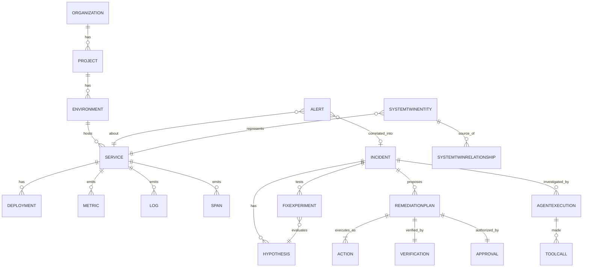

# 10 — Telemetry & Data Model

> Status: entities marked per [03-system-overview.md](03-system-overview.md) conventions. Storage technology decisions and tradeoffs: [19-architecture-decisions.md](19-architecture-decisions.md).

## Two data domains with different rules

| | **High-volume telemetry** | **Product / control-plane data** |
|---|---|---|
| Examples | metrics, logs, spans, diffs | orgs, incidents, plans, experiments, approvals, audit |
| Volume | 10⁴–10⁵ events/sec | 10⁰–10² records/min |
| Write pattern | append-only, immutable | transactional, stateful |
| Retention | time-based, aggressive (metrics 30d raw / longer rolled up; logs 14–30d; traces 7–14d) | long-lived (incidents ≥1y; audit per policy) |
| Consistency needs | at-least-once + idempotent ordering (vector clocks) | ACID (approvals, plans, audit must be exactly-once, strongly consistent) |
| Store | Kafka (in-flight) + TimescaleDB (metrics) + event store + object storage for raw payloads | PostgreSQL (single OLTP store for control plane + Twin graph) |

This split is the most important modeling decision: **never** store product truth (incidents, approvals, audit) in a telemetry-grade store, and never force OLTP workloads onto telemetry stores.

## Entity catalog

### Control plane & product

**Organization** `[PROPOSED]`
- Purpose: tenant boundary; all data is scoped under an org.
- Key fields: id, name, plan, autonomy level, policy set.
- Relationships: 1..* Projects. All rows in every table below carry `org_id` and every query path enforces it (tenant isolation test is a release gate, [14-security.md](14-security.md)).
- Storage: Postgres.

**Project** `[PROPOSED]`
- Purpose: grouping of environments/services a team owns.
- Fields: id, orgId, name, default policies.
- Relationships: 1..* Environments. Storage: Postgres.

**Environment** `[PROPOSED]`
- Purpose: prod/staging/sandbox distinction; autonomy policy differs per environment.
- Fields: id, projectId, name, environment policy (allowed tools, blast-radius limits).
- Storage: Postgres.

**Service** `[PLANNED]` (catalog auto-derived from telemetry — BUILD-PLAN FR-005)
- Purpose: primary navigation and targeting unit.
- Fields: id, orgId, projectId, environmentId, name, currentVersion, deployId, health, criticality.
- Indexing: by org/project/env; lookup by name must be unique per environment.
- Storage: Postgres (catalog) + Redis (live hot state).

**Deployment** `[PROPOSED]`
- Purpose: what changed and when — the #1 evidence source for investigations.
- Fields: id, serviceId, version, commit, deployedAt, deployedBy (CI/user), diffSummary, healthAfter.
- Relationships: 1 Service → N Deployments.
- Indexing: (serviceId, deployedAt desc). Retention: ≥90d.
- Storage: Postgres.

**API Key** `[PROPOSED]`
- Purpose: SDK/integration authentication.
- Fields: id, orgId, projectId, scopes (ingest / read / admin), hash, createdAt, lastUsedAt, expiresAt, revokedAt.
- Secrets are hashed (never plaintext after creation); scoped, rotatable, revocable ([14-security.md](14-security.md)).
- Storage: Postgres.

**User / Role** `[PROPOSED]`
- Purpose: authn/authz for humans.
- Fields: id, orgId, role (admin, approver, viewer), identity provider link.
- Storage: Postgres.

### Telemetry

**Metric** `[PLANNED]` (pipeline partially `[IMPLEMENTED]` — Avro `METRIC_RECORDED` flows to Kafka)
- Purpose: numeric time-series evidence.
- Fields: series key (org, service, metric name, tags), timestamp, value; event form carries `id` (idempotency key), `vectorClock`.
- Storage: TimescaleDB hypertables partitioned by time; raw 30d, rollups (1m/1h/1d) longer.
- Indexing: (series_key, ts desc); tag GIN index for tag filters.
- Volume driver: batch inserts ≥5k rows/sec sustained target.

**Log** `[PLANNED]` (types exist `[IMPLEMENTED]`; pipeline missing)
- Purpose: primary human-readable evidence.
- Fields: id, serviceId, ts, level, message, structured context, traceId/spanId links.
- Storage: TimescaleDB or Postgres with time partitioning; full-text index (tsvector) + structured filters. Retention 14–30d. Exemplar-only in AI context (capped).
- Indexing: (serviceId, ts desc), GIN(tsvector), (traceId).

**Trace / Span** `[PLANNED]` (types exist; pipeline missing)
- Purpose: request-path evidence; source of topology edges.
- Fields: Trace: id, root service, start, duration, status. Span: id, traceId, parentId, serviceId, operation, duration, tags, status.
- Storage: TimescaleDB (spans partitioned by time); traces 7–14d retention.
- Indexing: (traceId), (serviceId, ts), (duration desc) for slow-trace queries.

**Event** (domain event: alerts, incident transitions, approvals, actions) `[PLANNED]` (Kafka part `[IMPLEMENTED]`)
- Purpose: durable, ordered, replayable record of everything significant; the System Twin's historical substrate ([04-system-twin.md](04-system-twin.md)).
- Fields: id (idempotency key), type, entity, entityId, payload (Avro schema per type), timestamp, vectorClock.
- Schema governance: Avro + Schema Registry, backward-compatible evolution only `[IMPLEMENTED]` for `METRIC_RECORDED`.
- Storage: Kafka (retention 7d) + event store (append-only, cursor-replay-capable) — see [19-architecture-decisions.md](19-architecture-decisions.md) for the Mongo vs Postgres event-store question.

**DiffEvent** `[PLANNED]` (TS type exists `[IMPLEMENTED]`; producer missing)
- Purpose: compact live-state deltas pushed over WebSocket.
- Fields: type (PATCH|SNAPSHOT|DELETE|ALERT), entity, id, changes.
- Storage: transient (Redis-backed stream queues); not durable.

### Incidents & AI

**Incident** `[PROPOSED]` — full definition in [09-incident-engine.md](09-incident-engine.md) § Incident record contents.
- Storage: Postgres; timeline as append-only child rows; embedding column for memory (pgvector).

**Alert** `[PLANNED]` (anomaly-detector app scaffolded)
- Purpose: individual detection signal before correlation.
- Fields: id, orgId, serviceId, type (threshold/anomaly/log-pattern), metric ref, value, threshold, severity, dedupKey, ts, incidentId?.
- Storage: Postgres; dedupKey unique-active index for dedup.

**Hypothesis** `[PROPOSED]` — structured root-cause hypothesis ([06-ai-architecture.md](06-ai-architecture.md) § Hypothesis generation).
- Fields: id, incidentId, statement, prior, supports[], contradicts[], discriminatingQueries[], status, citations[].
- Storage: Postgres child of Incident.

**FixExperiment** `[PROPOSED]` — full definition in [05-fix-lab.md](05-fix-lab.md) § FixExperiment.
- Fields: id, incidentId, baselineStateRef, hypothesisId, proposedChange (structured), environment, workload, expectedOutcome, observedOutcome, risk, blastRadius, duration, confidence, result, cost.
- Storage: Postgres; observed measurements reference telemetry store (no copying).

**RemediationPlan** `[PROPOSED]` — structured plan ([06-ai-architecture.md](06-ai-architecture.md) § Planning).
- Fields: id, incidentId, basedOn (hypothesis, experiments), steps[] (action, target, risk, blastRadius, preconditions, rollback, timeout), verification (successCriteria, window, onFailure), planHash.
- Storage: Postgres; immutable after approval (approval binds planHash).

**Action** `[PROPOSED]` — one executed plan step.
- Fields: id, planId, stepIndex, tool, inputs, beforeState, afterState, startedAt/finishedAt, result, rollbackActionId?.
- Storage: Postgres.

**Verification** `[PROPOSED]`
- Purpose: empirical record that remediation worked or failed.
- Fields: id, planId, successCriteria, evaluations[] (criterion, observed, ts, pass/fail), outcome, window.
- Storage: Postgres.

### System Twin

**SystemTwinEntity** `[PROPOSED]` — node in the Twin graph ([04-system-twin.md](04-system-twin.md)).
- Fields: id, orgId, kind (service/datastore/queue/infra), refId (e.g. Service.id), state (JSONB, CRDT-merged live layer), provenance (source, sourceRef), lastUpdated, freshness.
- Relationships: 1:1 with Service for services; inferred entities reference telemetry-derived ids.
- Storage: Postgres (graph) + Redis (live hot state per entity).

**SystemTwinRelationship** `[PROPOSED]` — edge with trust metadata.
- Fields: id, fromEntityId, toEntityId, kind (runtime_call, data_store, queue_produce/consume, infra), confidence, source (inferred|declared), firstSeen, lastSeen, status (fresh|stale), metadata (callRate, p99, errorRate).
- Indexing: (from, kind), (to, kind) for blast-radius traversal.
- Storage: Postgres.

### Agent & audit

**AgentExecution** `[PROPOSED]`
- Purpose: one AI-plane run (investigation, experimentation, planning) with full trace.
- Fields: id, incidentId, phase, startedAt/endedAt, tokenUsage, cost, provider, model, result status, failureReason?.
- Storage: Postgres.

**ToolCall** `[PROPOSED]`
- Purpose: every tool invocation, for audit + evaluation ([16-ai-evaluation.md](16-ai-evaluation.md)).
- Fields: id, agentExecutionId, tool, inputs (redacted per [14-security.md](14-security.md)), outputs (size-capped), duration, result, policyDecision (allowed/denied + reason).
- Storage: Postgres, partitioned by time; retention ≥1y. Append-only.

**Approval** `[PROPOSED]`
- Fields: id, planId, planHash, approverId, requestedAt, decidedAt, decision, expiresAt.
- Storage: Postgres; immutable.

## Entity relationship overview

## Retention summary

| Data | Raw retention | Aggregate retention |
|---|---|---|
| Metrics | 30d (TimescaleDB) | 13 months rollups |
| Logs | 14–30d | — |
| Spans/traces | 7–14d | trace *statistics* 90d |
| Kafka topics | 7d | — |
| Events (event store) | 90d | incident-scoped excerpts kept with incident |
| Incidents, plans, experiments, actions, verification | ≥1y | — |
| Audit (ToolCall, Approvals, AgentExecution) | per policy, ≥1y | — |

## Related documents

Storage decisions & tradeoffs: [19-architecture-decisions.md](19-architecture-decisions.md) · Twin semantics: [04-system-twin.md](04-system-twin.md) · API contracts: [12-api-contracts.md](12-api-contracts.md)